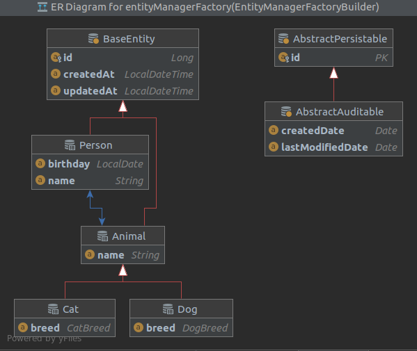
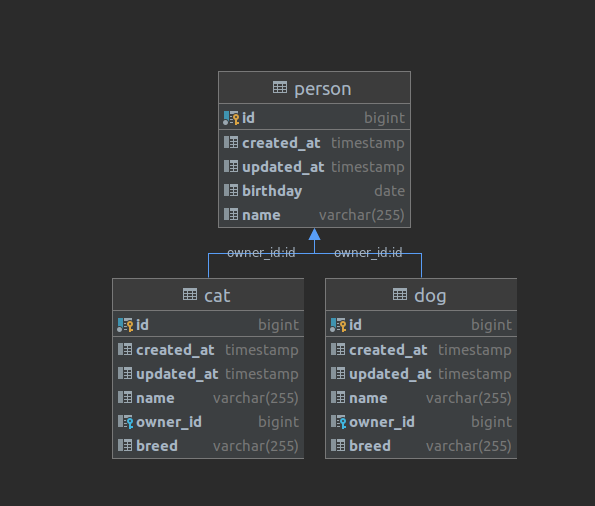

# HOME PETS

## Use cases

* A person can have an animal
* Animals are dogs and cats
* If person disappeared, his animals disappeared too
* Animal couldn't have owner
* Owners can swap animals

## Requirements

* Spring Boot web service 
* CRUD operations for entities
* Validation 
* Spring profiles

## Database

### Jpa layer

### Database layer

## Postman

You can test API with using postman [collection](docs/postman)