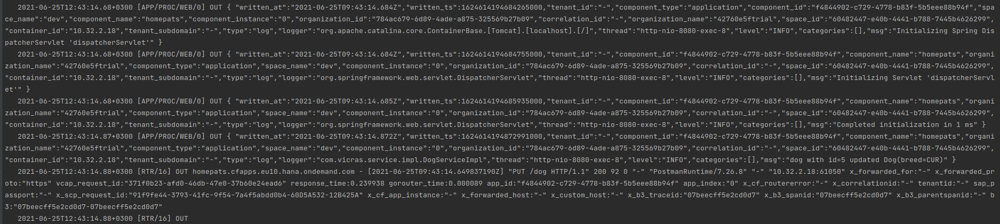
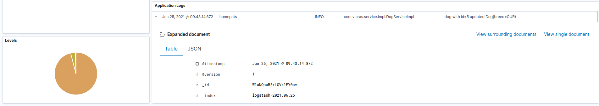

# HOME PETS

## Use cases

* A person can have an animal
* Animals are dogs and cats
* If person disappeared, his animals disappeared too
* Animal couldn't have owner
* Owners can swap animals

## Requirements

* Spring Boot web service
* CRUD operations for entities
* Validation
* Spring profiles

## Database

### Jpa layer


### Database layer


## Postman

You can test API with using postman [collection](docs/postman)

## SAP Cloud Foundry

To deploy application

* Register account on [hana.ondemand.com](https://account.hana.ondemand.com/#/home/welcome)
* Create trial home account
* Download cf cli from [here](https://docs.cloudfoundry.org/cf-cli/install-go-cli.html)
* Set _API endpoint_ :
    * Cross over Subaccount and get link
    * Put ```cf api [your endpoint]``` API ENDPOINT [help](https://docs.cloudfoundry.org/running/cf-api-endpoint.html)
* Login with your credentials ```cf login```
* Clone this repository
* From root folder (HomePats) Put commands:
  > mvn clean install spring-boot:repackage -P Cloud

  > cf push

Application successfully deployed

You can use `cf logs homepats --recent` to get logs from your app

In order to use JDK 11, you need to use java buildpack v4.16+. The jre version should be set
in `JBP_CONFIG_OPEN_JDK_JRE`.

`manifest.yml` will look like

```
applications:
  - name: homepats
    instance: 1
    memory: 1G
    disk_quota: 512M
    path: target/home_pats_app-1.0-SNAPSHOT.jar
    buildpack: https://github.com/cloudfoundry/java-buildpack.git#v4.16
    env:
      JBP_CONFIG_OPEN_JDK_JRE: '{ jre: { version: 11.+}}'
```

#### How to add PostgreSQL service

  - Create new instance of postgresql service 

> cf create-service postgresql trial [name of service]

  - Add to manifest new line:
```
    services:
    - [name of new service]
```

  - Redeploy app 


## Connect to database from Idea

  - Enable ssh to space: `cf allow-space-ssh dev`
  - Enable ssh to application: `cf enable-ssh [app name]`
  - Redeploy application
  - Create ssh tunnel:
> cf ssh -L [localhost]:[localport]:[hostname]:[port] [app name] -N

> Example:
> 
> cf ssh -L localhost:9876:postgres-1f6d52da-60a1-4c1d-996f-69993c5e64e6.ce4jcviyvogb.eu-central-1.rds.amazonaws.com:2441 homepats -N


**Result:**


## Customizing logs 

1. Add file `src/main/resources/logback-spring.xml`
   
2. Content of file:
```
<?xml version="1.0" encoding="UTF-8"?>
<configuration>
    <springProfile name="!cloud">
        <include resource="org/springframework/boot/logging/logback/base.xml"/>
        <root level="INFO"/>
        <logger name="org.springframework.web" level="INFO"/>
    </springProfile>
    <springProfile name="cloud">
        <appender name="STDOUT-JSON" class="ch.qos.logback.core.ConsoleAppender">
            <encoder class="com.sap.hcp.cf.logback.encoder.JsonEncoder"/>
        </appender>
        <root level="INFO">
            <appender-ref ref="STDOUT-JSON"/>
        </root>
        <logger name="com.sap.cloud.sdk" level="INFO"/>
        <logger name="package.to.log" level="DEBUG"/>
    </springProfile>
</configuration>
```

3. Add dependency to .pom file
```
<dependency>
    <groupId>com.sap.hcp.cf.logging</groupId>
    <artifactId>cf-java-logging-support-logback</artifactId>
    <version>${cf.logback.version}</version>
</dependency>
```

Logs example:

|  |
|:------------------------------:|
|  In terminal |


|  |
|:------------------------------:|
|  In kibana |

## LINK

  * More information about PostgreSQL service [here](https://help.sap.com/doc/bbbc4d8289764452a16a37a982822103/Cloud/en-US/PostgreSQL_EN.pdf)
  * More information about SAP Cloud Logging [here](https://sap.github.io/cloud-sdk/docs/java/guides/logging-overview/)
